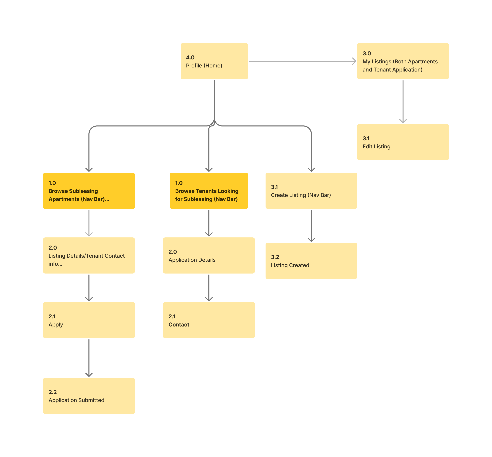

# UX Design - SubVet

## Prototype Links

- App map (Figma board): https://www.figma.com/board/PDqjK3OBx0uQolFUFnoWr2/App-Map-%E2%80%93-SubVet?node-id=0-1&p=f&t=AVDphTZdUtc6Kih9-0
- Wireframes (Figma design): https://www.figma.com/design/qovuDNZwsFhJaxjKhMKSXX/SubVet--wireframe?node-id=0-1&p=f&t=yHt5c1PeLEouWHFe-0

## App Map

The app map shows three main paths from the profile/home entry point:

1. Browse apartment listings and apply.
2. Browse tenant applications and contact applicants.
3. Create and manage your own listings.

This is the exported app map used for Sprint 0:

## Wireframes

Wireframe exports for Sprint 0 are stored here:

- PDF export: [SubVet Wireframes](./ux-design/subvet-wireframes.pdf)
- Editable source: [wireframes.drawio](./ux-design/wireframes.drawio)

### Screen Notes

- **4.0 Profile (Home)**: Landing point after login. From here, users can jump to browsing, creating a listing, or viewing their own listings.
- **1.0 Browse Subleasing Apartments**: Main feed for renters. Users can scan available units.
- **2.0 Listing Details / Tenant Contact Info**: Detailed view of a selected listing with enough info to decide whether to apply.
- **2.1 Apply**: Application form step.
- **2.2 Application Submitted**: Confirmation state after successful submission.
- **1.0 Browse Tenants Looking for Subleasing**: Main feed for owners who want to find tenant applicants.
- **2.0 Application Details**: Full view of an applicant's details.
- **2.1 Contact**: Owner reaches out to tenant from the application flow.
- **3.1 Create Listing (Nav Bar)**: Form flow for posting a new listing.
- **3.2 Listing Created**: Confirmation state after publishing a listing.
- **3.0 My Listings (Both Apartments and Tenant Application)**: Management view for all current listings and related tenant applications.
- **3.1 Edit Listing**: Update flow for existing listings.

## Interaction Summary

The MVP navigation is designed around two roles that can overlap for the same user: tenant and owner. The bottom-nav driven entry points keep both flows one tap away from home.

For Sprint 0, we focused on clear task completion states (apply submitted, listing created) so the next sprint can move directly into front-end implementation without changing core flow decisions.
